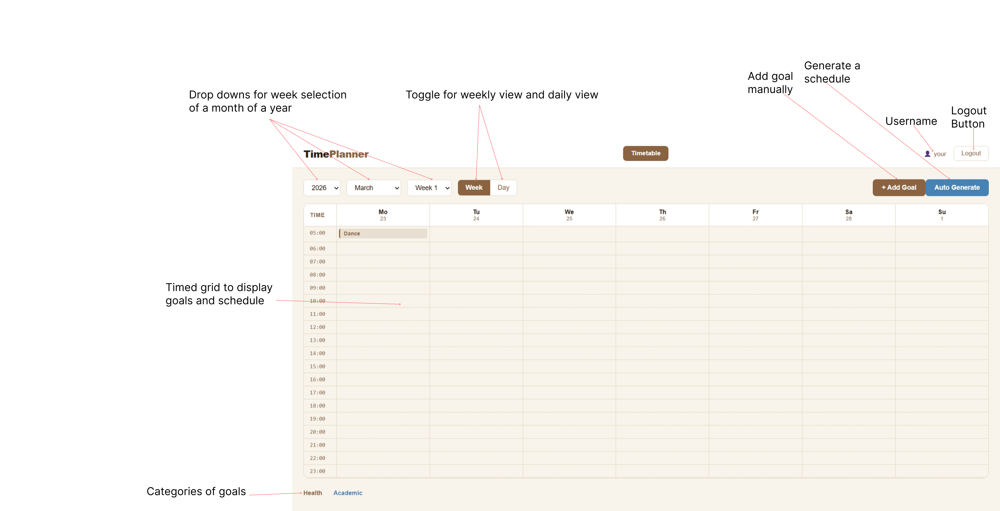
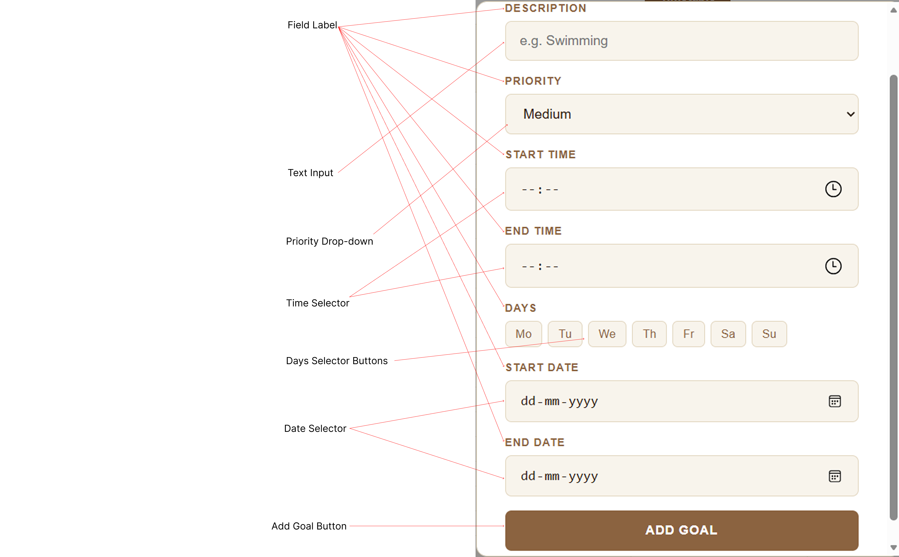

#Your read me should have written directions on how to use the app like steps 

# TimePlanner — Smart Time Table Planner

**Authors:** Kartik Sharma, Hanish Mehla

**Class:** CS 5610 Web Development Spring 2026 https://johnguerra.co/classes/webDevelopment_online_spring_2026/

## Project Objective

TimePlanner is a web app that helps you plan your time around goals. Add health and academic goals with priority, time slots and date ranges. The app detects scheduling conflicts, suggests resolutions based on priority, and flags unrealistic schedules. It allows to view timetable by week or day — color coded by category. It also provides algorithm planning based on goal-priority for a particular goal over a period of time.

## Screenshot

### Signup/SignIn


### Timetable


### Add Goal / Generate Goal


## Getting Started

**1. Clone the repo**

```bash
git clone https://github.com/kartik12sharma/TimePlanner.git
cd TimePlanner
```

**2. Install backend dependencies**

```bash
npm install
```

**3. Install frontend dependencies**

```bash
cd client
npm install
cd ..
```

**4. Set up environment variables**

Create a `.env` file in the root:

```
MONGO_URI=your_mongodb_connection_string
SESSION_SECRET=your_session_secret
PORT=5000
```

**5. Start the backend**

```bash
node server.js
```

**6. Start the frontend**

```bash
cd client
npm start
```

Open `http://localhost:3000` in your browser.

## Live Demo

https://timeplanner-5cge.onrender.com
